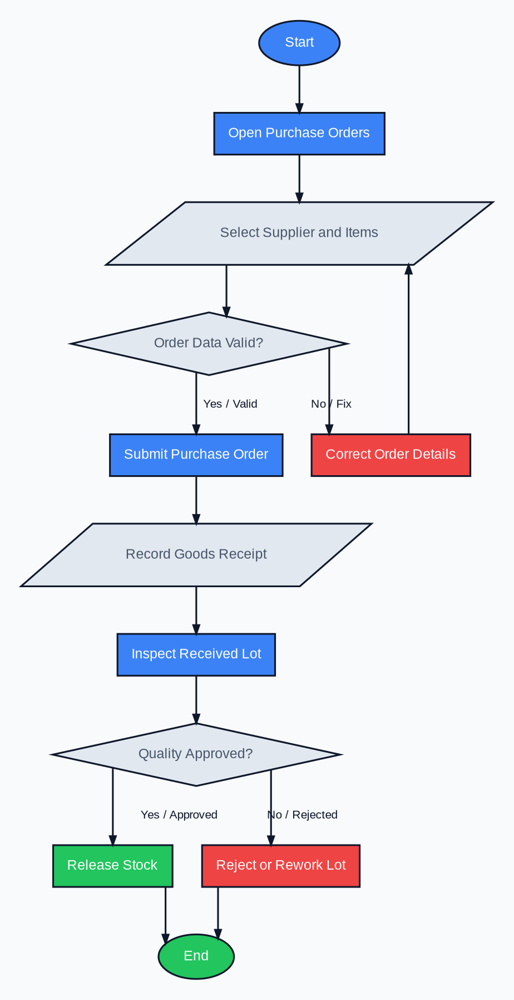

# Purchase Order Workflow

This workflow describes the Purchase Orders experience from the visible procurement screen through receiving and quality release.

## Node semantics

| Shape | Meaning | Workflow nodes |
|---|---|---|
| Oval | Start or end state | Start, End |
| Rectangle | Application process | Open, Correct, Submit, Inspect, Release, Reject |
| Diamond | Decision gate | Order Data Valid, Quality Approved |
| Parallelogram | User-entered or recorded data | Select Supplier and Items, Record Goods Receipt |

## Application mapping

- `Open Purchase Orders` maps to `/operations/purchase-orders/`.
- `Select Supplier and Items` maps to the purchase-order creation form.
- `Submit Purchase Order` creates a submitted purchase order and its lines.
- `Record Goods Receipt` creates a goods receipt, inventory lot, and pending QC inspection.
- `Inspect Received Lot` maps to the Quality queue and quality decision form.
- `Release Stock` marks the lot available and increases product stock.
- `Reject or Rework Lot` leaves rejected quantity unavailable; partial acceptance releases only the accepted quantity.
- Both completed branches return to the operational end state with activity and notification records.

## Visual tokens

| Token | Value | Usage |
|---|---|---|
| Canvas | `#F8FAFC` | Diagram background |
| Text and borders | `#0F172A` | Labels, outlines, connectors |
| Primary action | `#3B82F6` | Main path and active process nodes |
| Success | `#22C55E` | Approved and completed path |
| Warning or error | `#EF4444` | Correction and rejection path |
| Neutral | `#E2E8F0` with `#475569` text | Inputs and decision gates |
